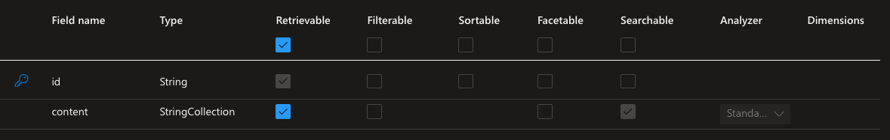
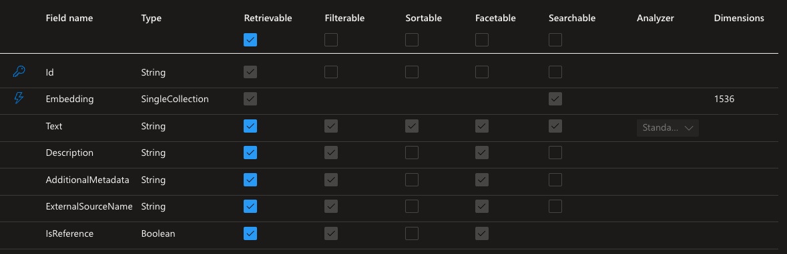

# Azure Cognitive Search: Azure Function Custom Skill for Generating and Persisting Embeddings

This repo provides a sample HTTP Triggered Azure Function for use as a Custom Skill within Azure Cognitive Search.

## Getting Started

Here are some things you will need in order to make use of this Custom Skill:

- [Azure Function App](https://learn.microsoft.com/en-us/azure/azure-functions/create-first-function-cli-csharp?tabs=linux%2Cazure-cli) where you will deploy this HTTP Triggered Azure Function
- [Azure Cognitive Search](https://learn.microsoft.com/en-us/azure/search/search-get-started-portal) instance
- Azure Open AI instance with a deployed model to be used for generating embeddings
- Azure Storage Account to act as a datasource for a Cognitive Search Indexer

## Azure Function

Within the Azure Function, please refer to the [inline comments](./ChunkerAndEmbeddingGenerator.cs) for detail on what the functionality is doing.  An example of how to easily deploy to a Function App is [here](https://learn.microsoft.com/en-us/azure/azure-functions/create-first-function-cli-csharp?tabs=linux%2Cazure-cli).

## Cognitive Search

Within Cognitive Search, you will need to create an index with a schema that matches what you see below.  This is simply an index for the indexer to write to, however, the Custom Skill will be writing to a separate index (that will get auto-created by Semantic Kernel).

The following image shows an example of the schema that Semantic Kernel will create.  

>You do not need to create this schema if using Semantic Kernel.  If you are using some other means to populate the index, you may need to create this index depending on the SDK you choose to use.

An example of a skillset definition is provided [here](./Assets/skillset.json).

An example of an indexer definition is provided [here](./Assets/indexer.json).

## Things to Keep in Mind

- This functionality has not been tested on large datasets.  With that said, the performance of the Function App should be monitored closely to ensure that the Function App is appropriately provisioned to handle the load.
- To decrease the overall time to index a dataset and generate embeddings, it would be wise to adjust the overall batch size (within the [indexer definition]((./Assets/indexer.json))) and the batch size of data records that can be sent at one time to the Custom Skill (you can adjust this in the [skillset defintiion](./Assets/skillset.json)).  Along with that, the max degree of parallelism can also be adjusted in the skillset definition.
